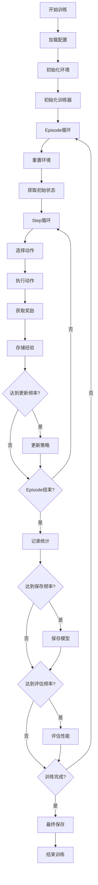

# 供热系统强化学习算法完整流程文档

**作者**: Dionysus  
**日期**: 2025-01-16  
**项目**: 供热网络智能控制系统

---

## 📋 目录

1. [项目概述](#项目概述)
2. [系统架构](#系统架构)
3. [核心组件详解](#核心组件详解)
4. [算法流程](#算法流程)
5. [训练过程](#训练过程)
6. [奖励函数设计](#奖励函数设计)
7. [数据流转](#数据流转)
8. [监控与可视化](#监控与可视化)
9. [性能优化](#性能优化)
10. [使用指南](#使用指南)

---

## 🎯 项目概述

### 问题定义
本项目旨在通过强化学习技术优化供热网络的阀门控制策略，实现：
- **温度控制**：维持各楼栋回水温度在目标范围内
- **能耗优化**：最小化系统能耗，提高运行效率
- **系统稳定**：保证供热系统运行稳定性

### 技术特点
- **算法**：基于PPO（Proximal Policy Optimization）的Actor-Critic架构
- **环境**：Dymola仿真环境，真实物理建模
- **状态空间**：92维（23个楼栋 × 4个状态变量）
- **动作空间**：23维连续动作（阀门开度控制）
- **奖励设计**：平滑可微分的多目标奖励函数

---

## 🏗️ 系统架构

```
┌─────────────────────────────────────────────────────────────┐
│                    强化学习训练系统                          │
├─────────────────────────────────────────────────────────────┤
│  ┌─────────────┐    ┌─────────────┐    ┌─────────────┐      │
│  │ 主程序模块   │    │ 环境模块     │    │ 训练器模块   │      │
│  │main_efficient│◄──►│heating_env  │◄──►│trainer_     │      │
│  │.py          │    │_efficient.py│    │efficient.py │      │
│  └─────────────┘    └─────────────┘    └─────────────┘      │
│         │                   │                   │           │
│         ▼                   ▼                   ▼           │
│  ┌─────────────┐    ┌─────────────┐    ┌─────────────┐      │
│  │ 配置管理     │    │ Dymola仿真   │    │ PPO算法     │      │
│  │config.json  │    │HeatingNetwork│    │Actor-Critic │      │
│  └─────────────┘    │.mo          │    │Network      │      │
│                     └─────────────┘    └─────────────┘      │
├─────────────────────────────────────────────────────────────┤
│  ┌─────────────┐    ┌─────────────┐    ┌─────────────┐      │
│  │ 奖励函数     │    │ 数据存储     │    │ 监控可视化   │      │
│  │smooth_reward│    │offline_data │    │web界面      │      │
│  │_functions.py│    │training_    │    │tensorboard  │      │
│  └─────────────┘    │result/      │    └─────────────┘      │
│                     └─────────────┘                        │
└─────────────────────────────────────────────────────────────┘
```

---

## 🔧 核心组件详解

### 1. 环境模块 (HeatingEnvironmentEfficient)

**文件**: `heating_environment_efficient.py`

**核心功能**：
- **Dymola接口管理**：初始化和控制Dymola仿真环境
- **状态空间定义**：提取23个楼栋的流量、压力、供水温度、回水温度
- **动作执行**：将智能体动作转换为阀门开度参数
- **奖励计算**：基于仿真结果计算奖励信号
- **数据收集**：保存离线数据用于后续分析

**关键方法**：
```python
# 环境重置
def reset() -> np.ndarray:
    # 重置Dymola仿真环境
    # 返回初始状态

# 执行动作
def step(action: np.ndarray) -> Tuple[state, reward, done, info]:
    # 1. 修改模型参数（阀门开度）
    # 2. 运行仿真
    # 3. 读取仿真结果
    # 4. 计算状态和奖励
    # 5. 判断是否结束
```

**状态空间设计**：
- **维度**：92维 (23个楼栋 × 4个变量)
- **变量**：
  - 流量 (Flow)
  - 压力 (Pressure) 
  - 供水温度 (Supply Temperature)
  - 回水温度 (Return Temperature)

**动作空间设计**：
- **维度**：23维连续动作
- **范围**：[0.5, 1.0] (阀门开度50-100%)
- **约束**：实际楼栋编号跳过8、14、15、16号，所有阀门开度保证大于50%

### 2. 训练器模块 (TrainerEfficient)

**文件**: `trainer_efficient.py`

**核心功能**：
- **神经网络管理**：Actor-Critic网络的创建和训练
- **经验收集**：存储状态-动作-奖励转换
- **策略更新**：基于PPO算法更新策略
- **模型保存**：定期保存训练好的模型

**网络架构**：
```python
class ActorCritic(nn.Module):
    def __init__(self, state_dim=92, action_dim=23, hidden_dim=128):
        # 共享特征提取层
        self.shared_layers = nn.Sequential(
            nn.Linear(state_dim, hidden_dim),
            nn.ReLU(),
            nn.Linear(hidden_dim, hidden_dim),
            nn.ReLU()
        )
        
        # Actor网络（策略网络）- 直接输出50%-100%范围
        self.actor_mean = nn.Sequential(
            nn.Linear(hidden_dim, hidden_dim),
            nn.ReLU(),
            nn.Linear(hidden_dim, action_dim)
            # 通过自定义激活函数映射到[0.5, 1.0]范围
        )
        
    def action_activation(self, x):
        """将网络输出映射到[0.5, 1.0]范围"""
        return torch.sigmoid(x) * 0.5 + 0.5
        
        # Critic网络（价值网络）
        self.critic = nn.Sequential(
            nn.Linear(hidden_dim, hidden_dim),
            nn.ReLU(),
            nn.Linear(hidden_dim, 1)
        )
```

**PPO算法实现**：
- **优势函数计算**：使用GAE (Generalized Advantage Estimation)
- **策略梯度**：带裁剪的策略梯度
- **价值函数损失**：均方误差损失
- **熵正则化**：鼓励探索

### 3. 奖励函数模块 (SmoothRewardFunctions)

**文件**: `smooth_reward_functions.py`

**设计理念**：
- **连续性**：所有奖励函数都是连续可微分的
- **平滑性**：避免硬阈值，使用平滑过渡
- **多目标**：同时考虑温度控制和能耗优化

**核心函数**：
```python
# 温度奖励计算
def _calculate_temp_reward(self, return_temps: np.ndarray) -> float:
    # 1. 理想温度范围奖励 (20-30°C)
    # 2. 温度极差惩罚
    # 3. 温度标准差惩罚
    # 4. 加权组合

# 阀门奖励计算  
def _calculate_valve_reward(self, valve_openings: np.ndarray) -> float:
    # 1. 特殊阀门处理 (12号、13号)
    # 2. 一般阀门能耗优化
    # 3. 开度变化平滑性
```

---

## 🔄 算法流程

### 整体训练流程



### 单步执行流程

1. **动作选择**：
   ```python
   # 1. 神经网络前向传播（策略网络直接输出50%-100%范围）
   action_mean_raw = self.actor_mean(features)
   action_mean = torch.sigmoid(action_mean_raw) * 0.5 + 0.5  # 映射到[0.5, 1.0]
   action_std, value = self.actor_std(features), self.critic(features)
   
   # 2. 采样动作（已在50%-100%范围内）
   dist = Normal(action_mean, action_std)
   action = dist.sample()
   action = torch.clamp(action, 0.5, 1.0)  # 确保在范围内
   
   # 3. 动作平滑处理（在50%-100%范围内平滑）
   action = self._apply_action_smoothing(action)  # 确保在[0.5, 1.0]范围内并平滑变化
   ```

2. **环境交互**：
   ```python
   # 1. 修改Dymola模型参数
   self._modify_model_parameters(valve_openings)
   
   # 2. 运行仿真
   success = self._run_simulation()
   
   # 3. 读取仿真结果
   results = self._read_simulation_results()
   
   # 4. 计算状态和奖励
   state = self._calculate_state(results)
   reward = self._calculate_reward(state, action)
   ```

3. **策略更新**：
   ```python
   # 1. 计算优势函数
   advantages, returns = self.compute_gae()
   
   # 2. PPO损失计算
   policy_loss = self._compute_policy_loss()
   value_loss = self._compute_value_loss()
   entropy_loss = self._compute_entropy_loss()
   
   # 3. 反向传播更新
   total_loss = policy_loss + value_loss - entropy_loss
   total_loss.backward()
   optimizer.step()
   ```

---

## 🎯 训练过程

### 训练配置

**超参数设置** (`config_efficient.json`)：
```json
{
  "num_buildings": 23,           // 楼栋数量
  "max_steps": 15,              // 每episode最大步数
  "simulation_time": 3600,       // 仿真时间(秒)
  "target_return_temp": 30.0,    // 目标回水温度
  
  "state_dim": 92,              // 状态维度
  "action_dim": 23,             // 动作维度
  "hidden_dim": 128,            // 隐藏层维度
  "learning_rate": 0.0003,      // 学习率
  
  "gamma": 0.99,                // 折扣因子
  "gae_lambda": 0.95,           // GAE参数
  "clip_epsilon": 0.2,          // PPO裁剪参数
  "entropy_coef": 0.01,         // 熵系数
  
  "batch_size": 32,             // 批次大小
  "update_epochs": 4,           // 更新轮数
  "update_frequency": 5,        // 更新频率
  
  "total_episodes": 1000,       // 总训练轮数
  "save_frequency": 10,         // 保存频率
  "eval_frequency": 20          // 评估频率
}
```

### 训练阶段

1. **初始化阶段**：
   - 创建Dymola仿真环境
   - 初始化Actor-Critic网络
   - 设置优化器和损失函数
   - 创建TensorBoard日志

2. **探索阶段** (前200 episodes)：
   - 高熵系数，鼓励探索
   - 较大的动作噪声
   - 收集多样化的经验数据

3. **学习阶段** (200-800 episodes)：
   - 逐渐降低探索率
   - 稳定的策略更新
   - 定期评估和保存

4. **收敛阶段** (800-1000 episodes)：
   - 低熵系数，利用学到的策略
   - 精细调优
   - 最终性能验证

### 训练监控

**关键指标**：
- **Episode奖励**：每轮训练的累积奖励
- **Episode长度**：每轮训练的步数
- **策略损失**：PPO策略梯度损失
- **价值损失**：Critic网络损失
- **熵值**：策略的探索程度
- **温度指标**：回水温度的控制效果
- **能耗指标**：阀门开度的优化程度

---

## 🏆 奖励函数设计

### 设计原则

1. **连续可微**：使用平滑函数替代硬阈值
2. **多目标平衡**：温度控制 + 能耗优化
3. **稀疏奖励避免**：每步都有有意义的奖励信号
4. **数值稳定**：避免奖励爆炸或消失

### 奖励组成

**总奖励公式**：
```
R_total = w_temp × R_temp + w_valve × R_valve
```

其中：
- `w_temp = 0.5`：温度奖励权重
- `w_valve = 0.5`：阀门奖励权重

### 温度奖励 (R_temp) - 基于实际数据优化版

**功能**: 基于实际仿真数据优化的温度一致性评估

**核心改进**:
- **异常值检测**: 针对22-36°C实际温度范围，检测低温异常（如V27:22°C）和高温异常
- **分布均匀性**: 使用Gini系数评估温度分布均匀性
- **温度聚类**: 奖励温度值聚集在理想范围（28-35°C）内
- **移除空间相关性**: 阀门编号不代表实际空间位置，移除梯度惩罚

**核心指标**:
- **标准差**: 针对实际2-4°C标准差优化阈值（权重35%）
- **四分位距(IQR)**: 针对实际3-6°C IQR优化（权重25%）
- **极差**: 针对实际8-14°C范围优化（权重20%）
- **聚类奖励**: 理想温度区间占比（权重10%）
- **均匀性评估**: Gini系数惩罚（权重10%）
- **异常值惩罚**: 超出25-36°C正常范围的惩罚（已减轻力度）

**奖励分级**（基于实际仿真数据优化）:
- 优秀: std≤2.0°C, IQR≤3.0°C, 极差≤8.0°C
- 良好: std≤3.0°C, IQR≤4.5°C, 极差≤11.0°C（包含实际2.9°C标准差和10-11°C极差）
- 可接受: std≤4.0°C, IQR≤6.0°C, 极差≤14.0°C
- 差: 超出可接受范围，给予负奖励

**实际数据适应性调整**:
- 异常值检测: 正常范围调整为25-36°C（适应V27的24-25°C低温）
- 温度聚类: 理想区间调整为28-35°C
- 均匀性评估: Gini系数阈值放宽至0.15
- 惩罚力度: 减轻异常值和极端情况的惩罚强度

```python
def _calculate_temp_reward(self, return_temps: np.ndarray) -> float:
    temps = np.array(return_temps)
    
    # 1. 标准差奖励（针对实际数据优化，权重35%）
    temp_std = np.std(temps)
    if temp_std <= 1.5:
        std_reward = 3.0 * np.exp(-temp_std)
    elif temp_std <= 2.5:
        std_reward = 2.0 * (2.5 - temp_std) / 1.0
    elif temp_std <= 3.5:
        std_reward = 0.5 * (3.5 - temp_std) / 1.0
    else:
        std_reward = -1.5 * np.tanh((temp_std - 3.5) / 2.0)
    
    # 2. 四分位距奖励（针对实际3-6°C范围优化，权重25%）
    q1, q3 = np.percentile(temps, [25, 75])
    iqr = q3 - q1
    if iqr <= 2.0:
        iqr_reward = 2.5 * np.exp(-0.5 * iqr)
    elif iqr <= 3.5:
        iqr_reward = 1.5 * (3.5 - iqr) / 1.5
    elif iqr <= 5.0:
        iqr_reward = 0.5 * (5.0 - iqr) / 1.5
    else:
        iqr_reward = -1.0 * np.tanh((iqr - 5.0) / 2.0)
    
    # 3. 极差奖励（针对实际8-14°C范围优化，权重20%）
    temp_range = np.max(temps) - np.min(temps)
    if temp_range <= 6.0:
        range_reward = 2.0 * np.exp(-0.3 * temp_range)
    elif temp_range <= 10.0:
        range_reward = 1.0 * (10.0 - temp_range) / 4.0
    elif temp_range <= 14.0:
        range_reward = 0.3 * (14.0 - temp_range) / 4.0
    else:
        range_reward = -1.5 * np.tanh((temp_range - 14.0) / 4.0)
    
    # 4. 聚类奖励（理想温度区间28-34°C占比，权重10%）
    ideal_count = np.sum((temps >= 28) & (temps <= 34))
    ideal_ratio = ideal_count / len(temps)
    cluster_reward = 1.5 * ideal_ratio
    
    # 5. 均匀性评估（Gini系数，权重10%）
    sorted_temps = np.sort(temps)
    n = len(sorted_temps)
    gini = (2 * np.sum(np.arange(1, n+1) * sorted_temps)) / (n * np.sum(sorted_temps)) - (n+1) / n
    uniformity_reward = -1.0 * gini  # Gini系数越小越好
    
    # 6. 异常值惩罚（超出27-36°C正常范围）
    outlier_count = np.sum((temps < 27) | (temps > 36))
    outlier_penalty = -2.0 * outlier_count / len(temps)
    
    # 7. 梯度惩罚（相邻传感器温差>3°C）
    temp_diffs = np.abs(np.diff(temps))
    large_gradient_count = np.sum(temp_diffs > 3.0)
    gradient_penalty = -0.5 * large_gradient_count / len(temp_diffs)
    
    # 综合温度一致性奖励（加权平均）
    total_temp_reward = (
        std_reward * 0.35 + iqr_reward * 0.25 + range_reward * 0.20 +
        cluster_reward * 0.10 + uniformity_reward * 0.10 +
        outlier_penalty + gradient_penalty
    )
    return float(np.clip(total_temp_reward, -8.0, 8.0))
```

### 阀门奖励 (R_valve) - 统一平滑处理

所有阀门采用统一的平滑奖励函数，不再分区间限制：

```python
def _calculate_valve_reward(self, valve_openings: np.ndarray) -> float:
    # 所有阀门统一处理：平滑奖励函数
    all_rewards = []
    
    for opening in valve_openings:
        # 使用平滑的sigmoid函数计算奖励
        # 在50-100%范围内，越高越好，但增长平滑
        normalized_opening = (opening - 50) / 50  # 归一化到[0,1]
        
        # 平滑奖励函数：sigmoid变形
        if normalized_opening >= 0:
            reward = 2.0 / (1.0 + np.exp(-6 * (normalized_opening - 0.5)))
        else:
            # 低于50%的惩罚
            reward = -1.0 * np.exp(abs(normalized_opening))
        
        all_rewards.append(reward)
    
    # 计算平均奖励
    valve_reward = np.mean(all_rewards)
    
    # 添加动作平滑性奖励（相邻动作变化不宜过大）
    if hasattr(self, 'last_valve_openings') and self.last_valve_openings is not None:
        action_diff = np.abs(valve_openings - self.last_valve_openings)
        smoothness_penalty = -0.1 * np.mean(action_diff)  # 变化越大惩罚越多
        valve_reward += smoothness_penalty
    
    # 保存当前动作用于下次计算
    self.last_valve_openings = valve_openings.copy()
    
    return float(np.clip(valve_reward, -4.0, 4.0))
```

### 平滑函数库

**核心平滑函数**：

1. **平滑阶跃函数**：
   ```python
   def smooth_step(x, threshold=0.5, steepness=10.0):
       return 1.0 / (1.0 + np.exp(-steepness * (x - threshold)))
   ```

2. **平滑钟形函数**：
   ```python
   def smooth_bell(x, center=0.0, width=1.0):
       return np.exp(-0.5 * ((x - center) / width) ** 2)
   ```

3. **平滑范围奖励**：
   ```python
   def smooth_range_reward(x, min_val, max_val, steepness=5.0):
       left = smooth_step(x, min_val, steepness)
       right = 1.0 - smooth_step(x, max_val, steepness)
       return left * right
   ```

---

## 📊 数据流转

### 数据类型

1. **实时数据**：
   - 状态向量 (92维)
   - 动作向量 (23维)
   - 奖励标量
   - 价值估计
   - 动作概率

2. **历史数据**：
   - 训练统计 (episode奖励、长度等)
   - 模型参数 (网络权重)
   - 离线数据 (完整的状态-动作轨迹)

3. **配置数据**：
   - 超参数设置
   - 环境配置
   - 网络架构参数

### 存储结构

```
training_result/
├── {session_id}/
│   ├── models/                    # 模型文件
│   │   ├── model_episode_100.pth
│   │   ├── model_episode_200.pth
│   │   └── ...
│   ├── stats/                     # 统计数据
│   │   ├── training_stats_100.json
│   │   ├── episode_rewards.csv
│   │   └── ...
│   └── tensorboard/               # TensorBoard日志
│       ├── events.out.tfevents...
│       └── ...
├── offline_data/                  # 离线数据
│   ├── offline_data_xxx.json
│   └── ...
└── simulation_results/            # 仿真结果
    ├── mat_files/
    └── log_files/
```

### 数据格式

**离线数据格式**：
```json
{
  "metadata": {
    "session_id": 1234,
    "episode": 1,
    "timestamp": "2025-01-16T10:30:00",
    "total_steps": 15
  },
  "trajectory": [
    {
      "step": 0,
      "state": [0.1, 0.2, ...],      // 92维状态
      "action": [0.5, 0.6, ...],     // 23维动作
      "reward": 0.85,
      "value": 12.3,
      "log_prob": -1.2,
      "done": false
    },
    // ... 更多步骤
  ],
  "summary": {
    "total_reward": 12.5,
    "avg_temp": 28.5,
    "temp_std": 1.2,
    "avg_valve_opening": 0.45
  }
}
```

---

## 📈 监控与可视化

### TensorBoard集成

**记录指标**：
```python
# 训练指标
writer.add_scalar('Training/Episode_Reward', episode_reward, episode)
writer.add_scalar('Training/Episode_Length', episode_length, episode)
writer.add_scalar('Training/Policy_Loss', policy_loss, update_step)
writer.add_scalar('Training/Value_Loss', value_loss, update_step)
writer.add_scalar('Training/Entropy', entropy, update_step)

# 环境指标
writer.add_scalar('Environment/Avg_Return_Temp', avg_temp, episode)
writer.add_scalar('Environment/Temp_Std', temp_std, episode)
writer.add_scalar('Environment/Avg_Valve_Opening', avg_opening, episode)

# 奖励分解
writer.add_scalar('Reward/Temperature_Reward', temp_reward, episode)
writer.add_scalar('Reward/Valve_Reward', valve_reward, episode)
```

### Web界面监控

**功能特性**：
- 训练会话选择
- TensorBoard启动/停止
- 实时状态监控
- 历史数据查看
- 模型性能对比

**界面组件**：
```html
<!-- 会话选择 -->
<select id="sessionSelect">
  <option value="">请选择训练会话...</option>
</select>

<!-- 控制按钮 -->
<button id="startTensorboardBtn">📊 启动 TensorBoard</button>
<button id="stopTensorboardBtn">🛑 停止 TensorBoard</button>
<button id="openBrowserBtn">🌐 打开浏览器</button>

<!-- 状态信息 -->
<div id="sessionInfo">会话详细信息</div>
<div id="statusInfo">服务状态信息</div>
```

### 数据分析工具

**分析脚本** (`analysis_results/data_converter.py`)：
- 离线数据转换为CSV格式
- 生成训练报告
- 创建可视化图表
- 性能指标统计

**可视化图表**：
- 训练曲线 (奖励、损失)
- 温度分布图
- 阀门开度热力图
- 动作轨迹图

---

## ⚡ 性能优化

### 计算优化

1. **批处理**：
   - 使用批量数据更新网络
   - 向量化计算减少循环
   - GPU加速神经网络训练

2. **内存管理**：
   - 经验回放缓冲区大小限制
   - 及时清理不需要的数据
   - 使用生成器减少内存占用

3. **仿真优化**：
   - 减少仿真步数 (max_steps=15)
   - 关闭Dymola可视化界面
   - 优化模型参数修改频率

### 训练优化

1. **超参数调优**：
   - 学习率调度
   - 批次大小优化
   - 网络架构搜索

2. **收敛加速**：
   - 预训练模型加载
   - 课程学习策略
   - 自适应探索率

3. **稳定性提升**：
   - 梯度裁剪
   - 奖励归一化
   - 网络权重初始化

### 多进程训练

**并行策略**：
- 创建独立的工作目录副本
- 避免Dymola编译文件冲突
- 不同超参数并行搜索
- 结果汇总和对比分析

**使用方法**：
```bash
# 创建4个进程副本
python copy_for_multiprocess.py --processes 4

# 批量启动训练
python batch_start_training.py
```

---

## 📖 使用指南

### 快速开始

1. **环境准备**：
   ```bash
   # 激活虚拟环境
   .venv\Scripts\activate
   
   # 安装依赖
   pip install -r requirements.txt
   ```

2. **单进程训练**：
   ```bash
   # 开始训练
   python main_efficient.py --mode train
   
   # 测试模型
   python main_efficient.py --mode test
   ```

3. **多进程训练**：
   ```bash
   # 一键启动（推荐）
   一键多进程训练.bat
   
   # 或手动执行
   python copy_for_multiprocess.py --processes 4
   python batch_start_training.py
   ```

4. **监控训练**：
   ```bash
   # 启动Web界面
   python start_web_viewer.py
   
   # 启动TensorBoard
   python start_tensorboard.py
   ```

### 配置调整

**修改训练参数**：
```json
// config_efficient.json
{
  "learning_rate": 0.0003,        // 学习率
  "batch_size": 32,              // 批次大小
  "total_episodes": 1000,        // 训练轮数
  "max_steps": 15,               // 每轮最大步数
  "hidden_dim": 128              // 网络隐藏层维度
}
```

**修改奖励权重**：
```python
# smooth_reward_functions.py
class SmoothRewardCalculator:
    def __init__(self, temp_weight=0.5, valve_weight=0.5):
        self.temp_weight = temp_weight    # 温度奖励权重
        self.valve_weight = valve_weight  # 阀门奖励权重
```

### 故障排除

**常见问题**：

1. **Dymola连接失败**：
   - 检查Dymola许可证
   - 确认Dymola安装路径
   - 重启Dymola服务

2. **内存不足**：
   - 减少批次大小
   - 降低网络隐藏层维度
   - 清理历史数据

3. **训练不收敛**：
   - 调整学习率
   - 检查奖励函数设计
   - 增加训练轮数

4. **多进程冲突**：
   - 使用副本创建脚本
   - 确保独立工作目录
   - 检查端口占用

---

## 🎉 总结

本强化学习系统通过以下关键技术实现了供热网络的智能控制：

### 核心优势

1. **算法先进性**：
   - PPO算法保证训练稳定性
   - Actor-Critic架构平衡探索与利用
   - 平滑奖励函数提高收敛性

2. **工程实用性**：
   - 真实物理仿真环境
   - 完整的监控和可视化系统
   - 多进程并行训练支持

3. **系统完整性**：
   - 端到端的训练流程
   - 丰富的数据分析工具
   - 灵活的配置管理

### 应用价值

- **节能减排**：优化阀门控制策略，降低系统能耗
- **温度控制**：精确维持各楼栋回水温度在目标范围
- **运行稳定**：提高供热系统运行的稳定性和可靠性
- **智能化**：实现供热系统的自主学习和适应能力

### 未来发展

- **算法改进**：探索更先进的强化学习算法
- **多目标优化**：引入更多优化目标和约束
- **实际部署**：从仿真环境向真实系统迁移
- **预测控制**：结合天气预报等外部信息

---

**文档版本**: v1.0  
**最后更新**: 2025-01-16  
**维护者**: Dionysus

如有问题或建议，请查看项目文档或联系开发团队。🚀